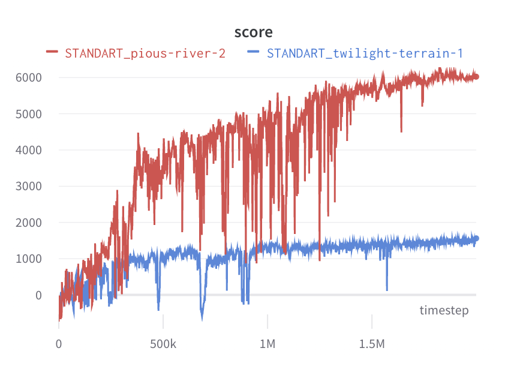

# Advantage Actor Critic (A2C): jax + flax implementation

Current version supports only environments with continious action spaces and was tested on mujoco 1.50 environments.  
Algorithm uses wandb logging.   

A2C uses a diagonal gaussian policy with state-independent action distribution variance.

## HalfCheetah-v3
Two runs with different seeds. Run with lower score (blue) arrived at a relatively rare local optimum.

